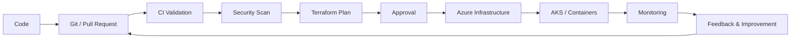
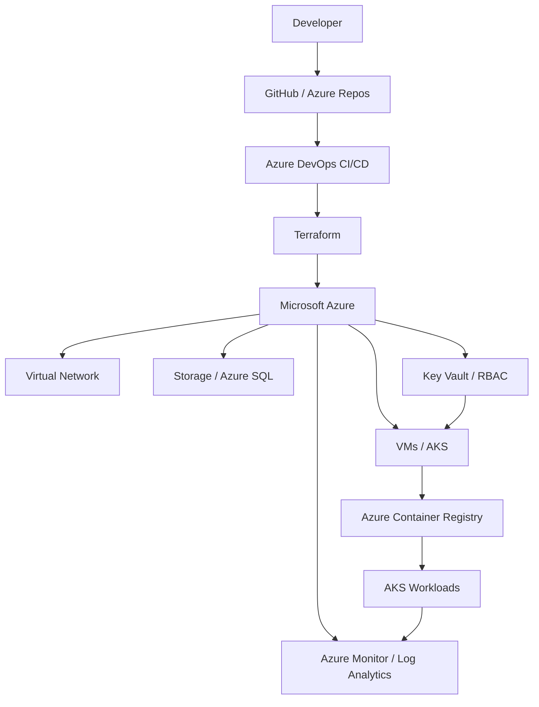

## 👋 About Me

I am a **DevOps / Cloud Engineer with around 4 years of hands-on experience** working across cloud infrastructure, Infrastructure as Code, CI/CD, containers, monitoring, security, and automation.

My strongest focus is building **repeatable, secure and observable Azure infrastructure** with Terraform and automating delivery through Azure DevOps and GitHub Actions.

### What I work with

- ☁️ **Cloud:** Microsoft Azure, AWS
- 🏗️ **IaC:** Terraform, reusable modules, remote state
- 🔄 **CI/CD:** Azure DevOps, GitHub Actions, Jenkins
- 🐳 **Containers:** Docker, Kubernetes, AKS, EKS, Helm
- 🔐 **Security:** Azure Key Vault, RBAC, Defender for Cloud, Trivy, SonarQube
- 📊 **Observability:** Azure Monitor, Log Analytics, Prometheus, Grafana
- ⚙️ **Automation:** PowerShell, Bash, Python
- 🖥️ **Systems:** Windows Server, Linux, Active Directory, Entra ID, Microsoft 365

## 🧭 DevOps Engineering Focus

## 🏗️ Cloud & Infrastructure Architecture

## 🚀 Featured Projects

| Project | What it demonstrates | Technologies |
|---|---|---|
| [**terraform-azure-enterprise-infra**](https://github.com/yeshpal-devops/terraform-azure-enterprise-infra) | Modular Azure infrastructure with networking, Key Vault, Bastion, AKS, ACR, SQL, Storage and monitoring | Terraform · Azure · AKS |
| [**azure-landing-zone-monolithic-app**](https://github.com/yeshpal-devops/azure-landing-zone-monolithic-app) | Environment isolation, reusable modules, remote state and Azure DevOps CI/CD | Terraform · Azure · Azure DevOps |
| [**kubernetes-learning-path**](https://github.com/yeshpal-devops/kubernetes-learning-path) | Structured Kubernetes learning, workloads, networking, storage and operations | Kubernetes · YAML |
| [**yeshpal-devops**](https://github.com/yeshpal-devops/yeshpal-devops) | GitHub profile and engineering portfolio | DevOps · Cloud |

> ⭐ **Portfolio story:** Azure infrastructure → Terraform → Landing Zone → CI/CD → Kubernetes → Security → Observability

## 🧰 Technical Stack

### Cloud

### Infrastructure as Code

### CI/CD

### Containers & Platform

### Scripting & OS

### Observability & Security

      

## 🔐 Engineering Principles

| Area | Approach |
|---|---|
| Infrastructure | Infrastructure as Code with reusable Terraform modules |
| Security | Least privilege, RBAC, managed identities and secret management |
| Delivery | Automated validation, plan, approval and deployment workflows |
| Reliability | Monitoring, logging, health checks and controlled releases |
| Environments | Separate Dev / QA / UAT / Prod configuration and state |
| Operations | Automation first, documented runbooks and repeatable processes |

## 📈 What I am Building Next

- 🔹 Production-grade Azure Landing Zone patterns
- 🔹 Private Endpoints and Private DNS
- 🔹 OIDC / Workload Identity for passwordless CI/CD
- 🔹 Terraform security scanning with Checkov
- 🔹 Azure Policy and policy-as-code
- 🔹 GitOps with Argo CD
- 🔹 Advanced Kubernetes and platform engineering
- 🔹 OpenTelemetry-based observability

## 🏆 Certifications

| Certification | Focus |
|---|---|
| **AZ-900** | Azure Fundamentals |
| **AZ-104** | Azure Administrator |
| **AZ-400** | Azure DevOps Engineer Expert |
| **AZ-500** | Azure Security Engineer |

## 💼 Professional Experience

### DevOps / Cloud Engineering

Hands-on experience across cloud infrastructure operations, automation, release engineering, CI/CD, Kubernetes, endpoint and identity administration, monitoring, security and troubleshooting.

**Core responsibilities include:**

- Designing and maintaining Azure/AWS infrastructure
- Building reusable Terraform modules and infrastructure workflows
- Creating and troubleshooting Azure DevOps CI/CD pipelines
- Managing Kubernetes workloads, deployments, services and ingress
- Implementing monitoring with Azure Monitor, Log Analytics, Prometheus and Grafana
- Managing secrets, identities, RBAC and cloud security controls
- Automating operational tasks using PowerShell, Bash and Python
- Supporting production incidents, releases, changes and infrastructure troubleshooting

## 🎓 Education

**Master of Computer Applications (MCA)** — Chandigarh University · *2025–2027, in progress*  
**Bachelor of Computer Applications (BCA)** — IEC University · *2019–2022*

## 📊 GitHub Activity

 

## 📫 Let's Connect

  

**Building secure cloud infrastructure. Automating delivery. Improving reliability.**

